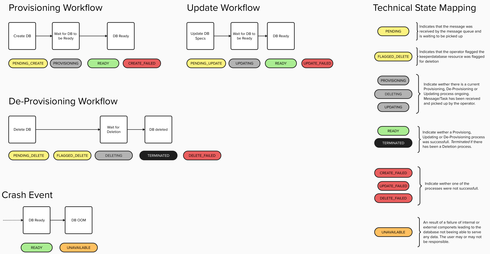

# States

Keeper manages database clusters through a defined set of states that represent the cluster lifecycle from creation to deletion. These states help track the current condition of each cluster and determine which actions are available.

## State Overview

Each database cluster transitions through various states based on user actions and system events. The state scheme ensures that operations are executed in the correct order and prevents invalid actions on clusters that are not in an appropriate state.

## Why States Matter

- **User Feedback**: States provide clear visibility into what is happening with a database cluster
- **Action Validation**: The system prevents actions that don't make sense for the current state (e.g., you cannot delete a cluster that is still being provisioned)
- **Recovery Handling**: Failed states allow for retry mechanisms and proper error handling through the NATS message queue

## Workflows

### Provisioning Workflow

The provisioning workflow handles the creation of new database clusters:

1. **PENDING_CREATE** → User initiates cluster creation via `Keeper Studio`, `Keeper Backend` publishes message to NATS
2. **PROVISIONING** → `Keeper Operator` has consumed the NATS message and is creating the `KeeperDatabase` custom resource and associated database cluster resources
3. **READY** → Database cluster is successfully provisioned and available for connections
4. **CREATE_FAILED** → `Keeper Operator` encountered an error while creating resources (e.g., insufficient cluster resources, invalid configuration)

### Update Workflow

The update workflow manages changes to existing database clusters (e.g., scaling replicas, adjusting resource limits):

1. **PENDING_UPDATE** → User requested an update via `Keeper Studio`, `Keeper Backend` publishes message to NATS
2. **UPDATING** → `Keeper Operator` is applying the requested changes to the `KeeperDatabase` resource and underlying database cluster
3. **READY** → Database cluster update completed successfully, cluster is operational with new configuration
4. **UPDATE_FAILED** → `Keeper Operator` encountered an error while applying updates

### De-Provisioning Workflow

The de-provisioning workflow handles the deletion of database clusters:

1. **PENDING_DELETE** → User requested deletion via `Keeper Studio`, `Keeper Backend` publishes message to NATS
2. **FLAGGED_DELETE** → `Keeper Operator` has marked the `KeeperDatabase` custom resource for deletion
3. **DELETING** → `Keeper Operator` is removing the database cluster, persistent volumes, and associated resources
4. **TERMINATED** → Database cluster and all resources have been successfully deleted
5. **DELETE_FAILED** → `Keeper Operator` encountered an error during resource cleanup

### Crash Event

When a database cluster experiences issues at runtime:

1. **READY** → Database cluster was operational and serving connections
2. **UNAVAILABLE** → Database is no longer able to serve data due to internal failures (e.g., pod crashes, OOM kills) or external component failures (e.g., storage issues, network problems) - the user may or may not be responsible

## Technical State Mapping

### Pending States

| State | Component | Description |
|-------|-----------|-------------|
| `PENDING_CREATE` | NATS | Create message was received by the NATS message queue and is waiting to be consumed by `Keeper Operator` |
| `PENDING_UPDATE` | NATS | Update message was received by the NATS message queue and is waiting to be consumed by `Keeper Operator` |
| `PENDING_DELETE` | NATS | Delete message was received by the NATS message queue and is waiting to be consumed by `Keeper Operator` |
| `FLAGGED_DELETE` | Keeper Operator | Operator has added deletion annotations to the `KeeperDatabase` custom resource |

### Processing States

| State | Component | Description |
|-------|-----------|-------------|
| `PROVISIONING` | Keeper Operator | Operator is creating the `KeeperDatabase` CR and database cluster resources (StatefulSets, Services, Secrets) |
| `DELETING` | Keeper Operator | Operator is removing the database cluster and cleaning up associated resources |
| `UPDATING` | Keeper Operator | Operator is applying configuration changes to the database cluster resources |

### Success States

| State | Component | Description |
|-------|-----------|-------------|
| `READY` | Database | Database cluster is operational - all pods are running and the database is accepting connections |
| `TERMINATED` | Keeper Operator | All cluster resources have been removed - deletion process completed |

### Failed States

| State | Component | Description |
|-------|-----------|-------------|
| `CREATE_FAILED` | Keeper Operator | Operator failed to create required resources (check operator logs for details) |
| `UPDATE_FAILED` | Keeper Operator | Operator failed to apply the requested changes to the cluster |
| `DELETE_FAILED` | Keeper Operator | Operator failed to remove all cluster resources cleanly |

### Error States

| State | Component | Description |
|-------|-----------|-------------|
| `UNAVAILABLE` | Database | Database cluster is not serving data - may be caused by pod failures, OOM events, storage issues, or network problems |